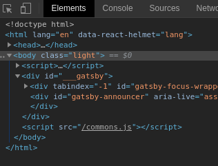
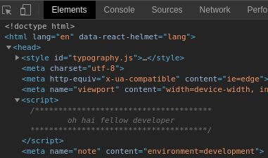
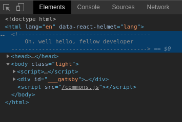

<Alert>

**<abbr title="too long;didn't read">tl;dr</abbr>**: Just [show me the code](#the-solution)!

</Alert>

Have you ever been browsing around the web and thought something on a webpage looked cool and wondered how they made that work? Maybe you were on [Keybase](https://keybase.io/) and fired up your dev tools with `F12`. All of a sudden, you are greeted with this:


"Oh, how nice," you think to yourself. "What a nice little greeting."

You smile thinking about how cool the keybase team is with their little "\o/ \o/" fake emojis and you forget why you even opened your dev tools in the first place.

You suddenly rise from your chair and exclaim "I'd like to add something like that to my site to make the developers of the world smile!"

But, you remember, "My site is built with [Gatsby](https://www.gatsbyjs.org/). How in the heck am I going to make that work?"

Rest easy, child. I've got your back. Keep reading to discover the secret to adding HTML comments to a website in 2020.

## Really, a comment? What's so hard about that?

When you first go to try and implement something like this, you might run into the fact that there really isn't a good way to [render HTML comments with React](https://stackoverflow.com/questions/40015336/how-to-render-a-html-comment-in-react) without resorting to hacks. A library like React (and Gatsby which uses React) mostly treat your outputted HTML as a build artifact. If you view it like that, there isn't really a reason to put comments in the build output. You can put comments all over your JS files, but none of that makes it to the outputted HTML.

### Simple Implementation

There a few workarounds to get an HTML comment to show up. The main way to do it is to use `dangerouslySetInnerHTML`. If all you are trying to do is get a comment to show up somewhere in your HTML, you could do this:

```js
import React from "react";

const HtmlComment = ({ text }) => (
	<div dangerouslySetInnerHTML={{
		__html: `<!-- ${text} -->`
	}} />
)

export default HtmlComment;
```

This will output a `div` with a comment in it:

```html
<div><!-- oh hai --></div>
```

That's not really what we want, though. We want our comment to live outside of any containing element. Not only that, but we want it to live as the first element under `html` (more on that later). We could try hijacking the `div` using imperative DOM methods to get rid of the containing element. Something like this could work:

```js
import React, { useEffect, useRef } from "react";
import { unmountComponentAtNode } from "react-dom";

const HtmlComment = ({ text }) => {
	const el = useRef();

	useEffect(() => {
		unmountComponentAtNode(el.current);
		el.current.outerHTML = `<!-- ${text} -->`;
	}, [text]);

	return <div ref={el} />;
};

export default HtmlComment;
```

This will work and get you some comments in your HTML without a surrounding `div`. However, since we are making use of `react-dom` here, this will not work for <abbr title="Server Side Rendering">SSR</abbr> which is what Gatsby does to render your site statically. `useEffect` also does not fire with SSR since the component is never actually mounted.

### Using Gatsby's SSR APIs

Gatsby provides some [extension points](https://www.gatsbyjs.org/docs/ssr-apis/) to add components to your `head` or `body`. We could make use of them by adding a `gatsby-ssr.js`:

```js
const React = require("react");

exports.onPreRenderHTML = ({ getHeadComponents, replaceHeadComponents }) => {
	const headComponents = getHeadComponents();

	replaceHeadComponents([
		React.createElement("script", {
			key: "html-comment",
			dangerouslySetInnerHTML: {
				__html: `
/**************************************
		oh hai fellow developer
**************************************/
`
			}
		}),
		...headComponents
	]);
};
```

This will add a `script` tag as the first element in your `head` with it's content set to a JS comment. Although this works and has the benefit of being able to be packaged up into a plugin that can easily be reused across all of your sites, it isn't exactly what we want. If you open dev tools with this solution:



You don't see shit. Chrome doesn't expand the `head`, much less a random `script` by default. No developers are going to see it buried in there:



We really need the comment to be the first thing under `html` for anyone to see it when they first open their dev tools. Unfortunately, Gatsby's SSR APIs don't provide a mechanism to make that work.

## The Solution

When the SSR APIs aren't enough, [Gatsby provides `html.js`](https://www.gatsbyjs.org/docs/custom-html/), a fallback mechanism to customize the default HTML that Gatsby generates.

Overriding the default `html.js` is not my first choice for extending Gatsby. It can't be packaged up into a plugin and if the default HTML is updated, you'd have to update your custom copy. But, for now, it seems to be the only way to get what we want.

We can add a `src/html.js` file to our site:

```js
import React from "react";
import { renderToStaticMarkup } from "react-dom/server";

const Html = ({ htmlAttributes, ...props }) => {
	// render the default markup to a string in a SSR friendly way
	const renderedChildren = renderToStaticMarkup(<Root {...props} />);

	// then dangerously set the inner HTML of the root HTML element
	// including our comment first and then the default markup
	return (
		<html
			{...htmlAttributes}
			dangerouslySetInnerHTML={{
				__html: `
<!---------------------------------------
	Oh, well hello, fellow developer
---------------------------------------->
				${renderedChildren}
			`
			}}
		/>
	);
};

// this is the default component html.js that Gatsby uses
const Root = ({
	headComponents,
	bodyAttributes,
	preBodyComponents,
	body,
	postBodyComponents
}) => (
	<>
		<head>
			<meta charSet="utf-8" />
			<meta httpEquiv="x-ua-compatible" content="ie=edge" />
			<meta
				name="viewport"
				content="width=device-width, initial-scale=1, shrink-to-fit=no"
			/>
			{headComponents}
		</head>
		<body {...bodyAttributes}>
			{preBodyComponents}
			<div
				key={`body`}
				id="___gatsby"
				dangerouslySetInnerHTML={{ __html: body }}
			/>
			{postBodyComponents}
		</body>
	</>
);

export default Html;
```

There are a few things going on here. We take the default `html.js` component Gatsby provides, rename it to `Root` and take the root `html` element out of it. We then add an `Html` component which renders `Root` to a string using [`ReactDOMServer.renderToStaticMarkup`](https://reactjs.org/docs/react-dom-server.html#rendertostaticmarkup) which will work when using <abbr title="Server Side Rendering">SSR</abbr>. Finally, we stuff all of that HTML into the root `html` element putting our comment first.

After all of that, when we open dev tools, we are greeted with:



Ah ha! We done did it! It was a long road with lots of plot twists, but we got here. If you've read this far, you are now armed with the skills to add comments to websites. Feel free to add that bullet point to your résumé.

Now go out there and add your own message to your own site. You'll have to think of something witty to say on your own.

If you enjoyed this article, [follow me on Twitter](https://twitter.com/wchadly) to get more of my crazy ideas **as I dream them up in real-time**. 😉
