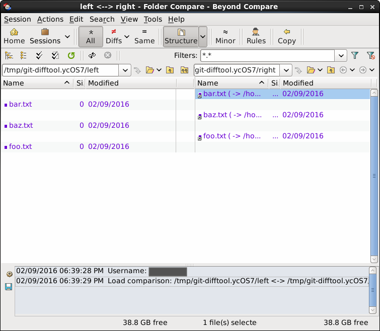

[Beyond Compare](http://www.scootersoftware.com/) has been my [favorite comparison tool for a while now](/2009/04/tortoise-svn-settings-for-beyond-compare-3/). It is cross-platform and makes diffs and 3-way merges very easy to understand and visualize.

## Configuring Beyond Compare 4

### [Git for Linux](http://www.scootersoftware.com/support.php?zz=kb_vcs#gitlinux)

To get it working on any linux flavor is pretty straight forward. Run these commands from terminal:

```bash
git config --global diff.tool bc
git config --global difftool.prompt false
git config --global difftool.bc trustExitCode true

git config --global merge.tool bc
git config --global mergetool.bc trustExitCode true
```

In order to get directory diffs working (e.g. `git difftool --dir-diff`), I had to tweak the settings a little bit. By default, git uses symlinks to do the directory diff and BC4 will not follow those by default yielding something that looks like this:



There are a couple of ways to fix this ([courtesy of StackOverflow](http://stackoverflow.com/a/35319884/316108)). The approach I like is updating Beyond Compare to follow the symlinks.

> In the **Folder Compare**, click the **Rules** toolbar button (referee icon). Go to the **Handling** tab. Check **Follow symbolic links**. To make this affect all new sessions, change the dropdown at the bottom of the dialog from **Use for this view only** to **Also update session defaults** before you click OK.

### [Git for Windows](http://www.scootersoftware.com/support.php?zz=kb_vcs#gitwindows)

On Windows, in addition to the above commands, you need to tell git the path to `bcomp.exe`:

```bash
git config --global difftool.bc.path "c:/program files/beyond compare 4/bcomp.exe"
git config --global mergetool.bc.path "c:/program files/beyond compare 4/bcomp.exe"
```

You don't need to do anything special to get directory diffs working on Windows.

### [Git for Visual Studio](http://www.scootersoftware.com/support.php?zz=kb_vcs#visualstudio-git)

Visual Studio includes a builtin diff viewer that is pretty nice. However, I don't find it as useful as I do Beyond Compare. Not to mention, it doesn't support 3-way merge. Instead of using your global git config, it forces you to change the git config file in the repo. Specifically, you need to open `git/config` in the repo and add the following:

```
[diff]
	tool = bc4
[difftool "bc4"]
	cmd = \"C:\\Program Files\\Beyond Compare 4\\BComp.exe\" \"$LOCAL\" \"$REMOTE\"
[merge]
	tool = bc4
[mergetool "bc4"]
	cmd = \"C:\\Program Files\\Beyond Compare 4\\BComp.exe\" \"$REMOTE\" \"$LOCAL\" \"$BASE\" \"$MERGED\"
```

Now, among other things, you can right-click files in VS and choose _Compare with Unmodified_ to open Beyond Compare.

## Configuring Beyond Compare 3

### [Git for Linux](http://www.scootersoftware.com/support.php?zz=kb_vcs#gitlinux)

Pretty much the only difference from above is using `bc3` instead of `bc`:

```bash
git config --global diff.tool bc3
git config --global difftool.prompt false
git config --global difftool.bc3 trustExitCode true

git config --global merge.tool bc3
git config --global mergetool.bc3 trustExitCode true
```

### [Git for Windows](http://www.scootersoftware.com/support.php?zz=kb_vcs#gitwindows)

On Windows, it is a little more work. In addition to the above, you need to tell git the path to `bcomp.exe`:

```bash
git config --global difftool.bc3.path "c:/program files (x86)/beyond compare 3/BCompare.exe"
git config --global mergetool.bc3.path "c:/program files (x86)/beyond compare 3/bcomp.exe"
```

The reason I am using `BCompare.exe` for the difftool instead of `bcomp.exe` is [described here](http://stackoverflow.com/a/13637243/316108). When using the new `--dir-diff` option of the `git difftool` command:

```bash
git difftool 4e560^^ --dir-diff
#4e560 is your commit hash that you want to show a whole directory-diff on in BC
```

Beyond Compare 3 [has a bug](http://theo.im/blog/2012/10/27/directory-comparison-for-git-difftool/) that is not fixed as of v3.3.12 where you need to employ this workaround. If you don't do it, `bcomp.exe` will exit too early, and no files will be available to diff while you are viewing the directory diff.

This is fixed in BC4, so you should probably just upgrade to that.

## Using It

Once you have it setup, you can easily run

```bash
git difftool path/to/my/file.js
```

in your working copy to show unstaged changes. If you want to see a diff of the whole directory, you can run:

```bash
git difftool --dir-diff
```

which opens BC's directory comparison which can't be beat IMO.

To resolve merge conflicts:

```bash
git mergetool
```

That will cycle through each merge conflict in the working copy and as long as you save the file from BC, the conflict will be marked resolved by git (hence the `mergetool.bc trustExitCode` setting).