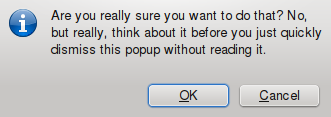
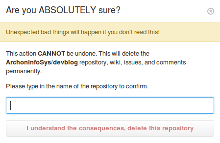

The good old native confirmation dialog -- have you ever been writing a web app and found yourself using one of these?



The tried-and-true `confirm("are you sure?")` is easy to code yet horrible for your user experience. 90%<sup>[citation needed]</sup> of users will ignore the carefully crafted message in your dialog and just press OK. If you are going to do a confirmation dialog, you should do it like Github does it:



This dialog forces the user to type out exactly what they are about to do. For an irreversible action, a dialog like this is ideal since the user _has_ to think about what they are doing in order to continue.

However, for actions that are not as severe as permanently deleting a git repository, a dialog like this is probably overkill - not to mention a pain to implement (compared to slapping a `confirm` in your code).

## Inline Confirmation to the Rescue

A pattern we have been using at [CivicSource](https://www.civicsource.com/) is the inline-confirm. Try out the demo:

<div id="knockout-confirm-demo" style="text-align: center">
	<button data-bind="inlineConfirm: ['Do the thing', 'Are you sure you want to do the thing?', 'Doing the thing…'], submitFunction: doit" class="btn btn-primary"></button>
</div>

We wrapped up the code to do this in a reusable knockout binding handler. To use it, it is just as easy as slapping a `confirm` in your code.

Before, a button just calls the `remove` function on the view model when it is clicked with no confirmation:

```html
<button data-bind="click: remove"></button>
```

After, the button avoids accidental clicks:

```html
<button data-bind="inlineConfirm: ['Delete', 'Are you really sure?', 'Deleting…'], submitFunction: remove"></button>
```

For a time-strapped developer, something like this is as easy to implement as a native confirmation dialog yet yields a much better user experience.

Check out the [repository on Github](https://github.com/civicsource/knockout-inline-confirm) and let us know what you think.