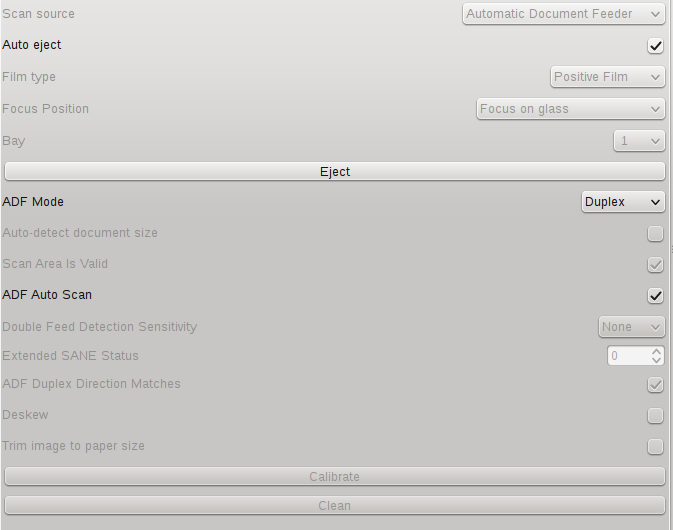
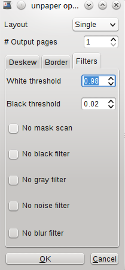

I'm a bit anal when it comes to digitizing all of my important paperwork. Back when I was using Windows, I used to use Adobe Acrobat to scan all my documents into PDF. It was simple and easy. Turn scanner on, load document, click scan in Acrobat -- out pops a nice optimized OCRd PDF.

In Mint, it _can_ be just as easy. It just took me a little bit to get my workflow setup with a different set of software.

###Install Scanner Drivers

[This thread](http://ubuntuforums.org/showthread.php?t=2105342) helped me out the most when I was trying to get this working. I've outlined the steps below.

Epson provides a linux driver for the scanner that you need to install. [Search GT-S50](http://download.ebz.epson.net/dsc/search/01/search/?OSC=LX) and download the "core package & data package" first. From there, accept the agreement and download and run the following in order:

* `iscan-data_1.26.0-1_all.deb`
* `iscan_2.29.3-1~usb0.1.ltdl7_amd64.deb`

The [FAQ](http://download.ebz.epson.net/faq/linux/faq_ls_00002.html) (link at bottom of that page) states you need to install the data package first and then the core package (libltdl7 for Ubuntu >= 8.10).

If you try to run the packaged scanner software, _Image Scan!_, now, it will give you the error:

> Could not send command to scanner. Check scanner's status.

This was the part I missed on my first go around. Go back to the original search results page and download the "iscan plugin package." Accept the agreement and download and run the `esci-interpreter-gt-s80_0.2.1-1_amd64.deb` package.

After that, you should be able to use any scanner application with your scanner. If the scanner still doesn't show up, you may have to reboot.

###Post Processing Scans

I've been using [gscan2pdf](http://gscan2pdf.sourceforge.net/) to replace my Acrobat workflow. The process is very similar. Under the covers, it uses [unpaper](http://unpaper.berlios.de/) and [tesseract](https://code.google.com/p/tesseract-ocr/) for cleaning up and OCRing the scans respectively.

####Installation

In order to get [past this bug](https://bugs.debian.org/cgi-bin/bugreport.cgi?bug=700108), I had to make sure I was using gscan2pdf's PPA in order to get the latest version. Run the following to get the app installed with its dependencies:

```bash
sudo apt-add-repository ppa:jeffreyratcliffe/ppa
sudo apt-get update

sudo apt-get install gscan2pdf
sudo apt-get install tesseract-ocr
sudo apt-get install unpaper
```

####Workflow

After opening gscan2pdf, click the `Scan` button which opens a scan dialog very similar to the one Adobe Acrobat uses. In order to get duplex scanning working properly, I had to make sure the following settings were set under `Page Options`:


Then navigate to `Optional Equipment` and set `ADF Mode` to `Duplex` and make sure `ADF Auto Scan` is checked:



After that, it has some nice post-processing options provided via unpaper and tesseract:


You might want to play with the white and black threshold filters depending on what you are scanning:



Once you tweak your settings to your liking, click `Scan` and you will have all your pages loaded in the app. From there, you can crop and/or clean up the pages more before you save it to PDF.