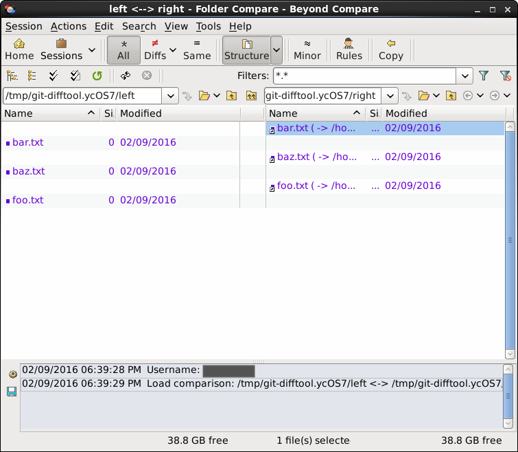

I've finally upgraded to [Beyond Compare 4](http://www.scootersoftware.com/) and I want to document how I set it up for myself. I've [previously done this with version 3](/2014/05/git-bcompare/) and it has gotten easier since then.

### [Git for Linux](http://www.scootersoftware.com/support.php?zz=kb_vcs#gitlinux)

To get it working on any linux flavor is pretty straight forward. Run these commands from terminal:

```bash
git config --global diff.tool bc
git config --global difftool.prompt false
git config --global difftool.bc trustExitCode true

git config --global merge.tool bc
git config --global mergetool.bc trustExitCode true
```

Pretty much the only difference [from last time](/2014/05/git-bcompare/) is using `bc` instead of `bc3`.

#### Directory Diffs

In order to get directory diffs working (e.g. `git difftool --dir-diff`), I had to tweak the settings a little bit. By default, git uses symlinks to do the directory diff and BC4 will not follow those by default yielding something that looks like this:



There are a couple of ways to fix this ([courtesy of StackOverflow](http://stackoverflow.com/a/35319884/316108)). The approach I like is updating Beyond Compare to follow the symlinks.

> In the **Folder Compare**, click the **Rules** toolbar button (referee icon). Go to the **Handling** tab. Check **Follow symbolic links**. To make this affect all new sessions, change the dropdown at the bottom of the dialog from **Use for this view only** to **Also update session defaults** before you click OK.

### [Git for Windows](http://www.scootersoftware.com/support.php?zz=kb_vcs#gitwindows)

On Windows, in addition to the above commands, you need to tell git the path to `bcomp.exe`:

```bash
git config --global difftool.bc.path "c:/program files/beyond compare 4/bcomp.exe"
git config --global mergetool.bc.path "c:/program files/beyond compare 4/bcomp.exe"
```

You don't need to do anything special to get directory diffs working on Windows.

### Using It

Once you have it setup, you can easily run

```bash
git difftool path/to/my/file.js
```

in your working copy to show unstaged changes. If you want to see a diff of the whole directory, you can run:

```bash
git difftool --dir-diff
```

which opens BC's directory comparison which can't be beat IMO.

To resolve merge conflicts:

```bash
git mergetool
```

That will cycle through each merge conflict in the working copy and as long as you save the file from BC, the conflict will be marked resolved by git (hence the `mergetool.bc3 trustExitCode` setting).
