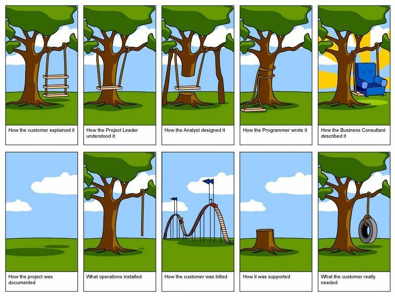

I just ran across this [video presentation](http://www.balsamiq.com/blog/?p=375) with software development advice from Jason Fried - from 37Signals. It's not really anything I haven't heard before, it is coming from an interesting perspective though. Here are some highlights and things that jumped out at me:

## Small Iterations
He talks about one of the tenets of Agile practice, the importance of doing short iterations (rather than long month-long stints) of software releases. But he talks about it for the purpose of keeping the excitement in a project up. As far as the stakeholders in a project our concerned, this is a very important aspect. It is important to keep the stakeholders in a project interested and excited about what you are doing.

## Functional Specs Suck
Functional specs don't work. They are abstractions of the software that you are actually building. Two people can read the same spec document and have completely different ideas of how the software will work. Focus instead on building your software - "doing more of what works, and less of what doesn't." With the short iterations and quick feedback cycles with your stakeholders, this leads to a much better design than any functional spec could.

## Red Flag Words
A lot of "red flag words" can lead to a project going awry. "Need" is a big one. Most of the time, the client has no idea what he actually _needs_ (see image below). Don't let the client/stakeholder steer you in the wrong direction.

"Easy" is another one -- "oh just get this-and-this done, it should be easy." Or one that I have heard myself - "Why can't you just, you know, clickity-click it and get it done?" It leads to animosity and sets people up for failure. (I know my wife has experienced this first-hand at her job…)

He goes on to talk about a lot of other things. One of the main themes is ease of use.  Is your software easy to use? Does it solve a problem in a way that makes people want to use it? Overall, its a good presentation if you are writing software for any type of business capacity. Go give it a listen.