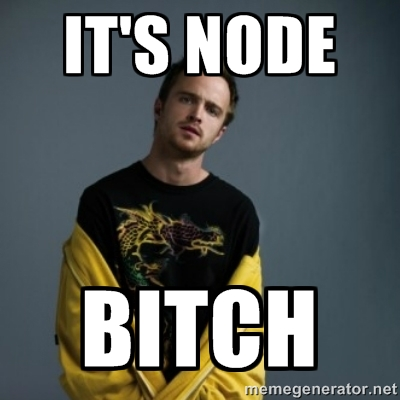

I recently decided to switch my site over from [Ghost](https://ghost.org/) to [Wintersmith](http://wintersmith.io/), a static site generator.

> But, Chad, weren't you just [recently raving](/2013/10/user-experience-matters-more-than-you-think/) about how great Ghost was?
> <cite>Random Internet Person</cite>

Why, yes, Random Internet Person, I was. Please allow me to explain before interrupting.

## Static Site Generator > Ghost?

Ghost's user experience was the major reason it had such an impact on me. It really does have the nicest writing experience on the web. But when it comes down to it, I guess I found the whole idea of a blog engine in general to be restricting. As a web developer, I want to be able to easily work with pages and HTML and not necessarily be limited by a blog format. In the end, the major thing I really liked about Ghost was the fact that I could write posts in Markdown instead of some horrible WYSIWYG editor.

## Enter Wintersmith

Why not get the best of both worlds? A framework that allows me to be a web developer but at the same time gives me the ease of use of working with Markdown.

Static site generators have become very popular as of late -- [Jekyll](http://jekyllrb.com/) probably being the most popular since [Github Pages](http://pages.github.com/) uses it. I wanted to use one built on nodeJS though. Because, well&hellip;



Wintersmith allows you to create content pages in Markdown and have those merged into HTML templates. It supports a number of plugins for different templating engines. The default blog template Wintersmith ships with uses [Jade](http://jade-lang.com/). I quickly switched that to use [Handlebars](http://handlebarsjs.com/) because I don't hate myself.

With the [existing set of plugins](https://github.com/jnordberg/wintersmith/wiki/Plugins) out there, you can choose whichever combination of frameworks makes the most sense for you. For a developer, it feels much more empowering to use something like Wintersmith rather than an existing blog platform.

> But with Ghost, it was very easy to change the theme of your site. Now you are stuck with whatever you have now.
> <cite>Random Internet Person</cite>

[Bootstrap](http://getbootstrap.com) is my designer-in-a-box. For one that is not "designer-inclined," Bootstrap allows me to put something decent together pretty quickly. Not to mention there are a [wealth](http://bootswatch.com/) of [customization options](http://www.lavishbootstrap.com/). Also, Bootstrap is a base for web applications, not limited to just blogs. So, when I get the urge to put up more than just a random blog post on my site, I can without much hassle.

> But how are you going to do things like post drafts without a blogging framework?
> <cite>Random Internet Person</cite>

For me as a developer, branching with git is very natural. And now that I am managing my site with git, it is very easy to branch off of `master` if I want to work on a post for a little while without publishing it. I can understand why a non-developer end-user would think I am crazy. But that is why things like Ghost still have a place. I still think it is the best blogging framework around. I just don't want to use one of those anymore.

Not to mention, Github has some of the [best features around](https://help.github.com/articles/github-flow-in-the-browser) for doing things with your repository directly from the browser. It is possible to create a branch, work on it for a little while, and eventually merge it back to `master` without ever having to clone the repository. Combine this with Github's Markdown editor with live previews and you got yourself a winner.

> But now you have a build step for your blog. You will have to build your static site and push it to a hosting provider everytime you want to publish a post. That sounds like a pain in the ass.
> <cite>Random Internet Person</cite>

Ah, Random Internet Person, you are wrong again.

## Wercker to the Rescue


[Wercker](http://wercker.com/) is a hosted <abbr title="Continuous Integration">CI</abbr> service that allows you to give it a build/deployment script that will automatically run everytime you push a change to a branch it is watching.

I have dealt with my fair share of <abbr title="Continuous Integration">CI</abbr> servers in the past, [Teamcity](http://www.jetbrains.com/teamcity/) the one I am most familiar with. Wercker, compared to them, is much easier to get setup and running. I really like the fact that they are a hosted service -- nothing I have to install and run locally. The concept of running your build on [preconfigured boxes](http://devcenter.wercker.com/articles/boxes/) is also appealing in that it avoids problems with different environment setups.

Luke Vivier has a [nice guide](http://luke.vivier.ca/wintersmith-with-wercker/) for setting up Wercker to deploy a Wintersmith site to Github Pages. I used his guide as a basis for setting up my workflow. However, I'm going to be publishing to Azure Websites, not Github Pages.

## Why not Github Pages?

This site has been through a number of frameworks -- [BlogEngine.net](http://www.dotnetblogengine.net/), [Wordpress](http://wordpress.org/), [Ghost](https://ghost.org/), and now [Wintersmith](http://wintersmith.io/). I have a lot of old "permanent" links that have changed and that I maintain `301` redirects for. Github Pages doesn't support redirects without some not-so-nice hacks.

## My Wercker Setup

Here is a quick rundown of how to get Wercker up and running publishing to Azure:

1. Sign up for wercker (it's free)

2. Add an application to your account and link it to your Github (or Bitbucket or wherever) repo.

3. Create a `wercker.yml` file in your root (see mine below) with your build and deployment steps.

4. Setup a custom deployment in Wercker that will auto-deploy your `master` branch after every succesful build.

5. Login to your Azure Management Portal and get your publish profile settings for the website you want to deploy to (`publishUrl`, `userName`, and `userPWD`).

6. In the custom deployment (from step 4), add some protected environment variables for your FTP settings from your publish profile.

The Wercker UI is very intuitive, but if you need more hand-holding, check out [Luke's post](http://luke.vivier.ca/wintersmith-with-wercker/).

```yaml
box: wercker/nodejs
build:
    steps:
        - script:
            name: install bower
            code: sudo npm install -g bower
        - npm-install
        - grunt:
            tasks: dist
deploy:
    steps:
        - wercker-labs/azure-ftp-deploy:
            cwd: build/
            publish-url: $FTP_URL
            username: $FTP_USERNAME
            password: $FTP_PASSWORD
```

The first part of the file chooses which box I want to run my build/deployment on. Wercker has a good amount of "official" and community-contributed boxes. For this site, I'm using the `wercker/nodejs` box. The next part of the file describes the build steps:

1. `sudo npm install bower -g` because my chosen box doesn't have it installed by default and I am using [Bower](http://bower.io/) to manage my web dependencies.

2. `npm-install` - this is a built-in step that Wercker provides. Again, there are a wealth to choose from and they basically just wrap shell commands. As you can see, if a step doesn't exist for what you want to do, you can just include the shell commands manually (like I did for the `install bower` step).

3. Run my grunt `dist` task. This task uses [grunt-wintersmith](https://github.com/davidtucker/grunt-wintersmith) to actually build the site into the `/build` folder. I'm using grunt because I want to be able to run this build from my local machine as well as from Wercker. Wercker simply calls my existing grunt build script.

The next part of the file describes the steps to deploy my site. It uses an existing [azure-ftp-deploy step](https://github.com/wercker-labs/step-azure-ftp-deploy) to `cd` to the `/build` folder and then just FTP everything it finds. It uses the protected environment variables `FTP_USERNAME`, `FTP_PASSWORD`, and `FTP_URL` (configured in Wercker) so I don't have to commit sensitive information in my repo.

Now, whenever I want to make changes to my site, it is just a matter of pushing to my `master` branch and in a couple of minutes, it is live. I am very happy with my new setup.

If you want to dig deeper into the code that runs all of this, checkout the [repo for this site on Github](https://github.com/chadly/chadly.net).