This site now runs on [Ghost](https://ghost.org/) in [Azure](https://azure.microsoft.com/) hosted for free[^1]. Yes, this blog has officially become nothing but me switching blog engines and then writing about it, but hey, maybe someone finds it useful? 🤷

<abbr title="Too long; didn't read">tl;dr</abbr>
1. Make a small change to ghost source code (for [iisnode](https://github.com/tjanczuk/iisnode))
2. Use [Azure App Service free tier](https://azure.microsoft.com/en-us/services/app-service/) to host your blog
3. Setup an [Azure CDN](https://azure.microsoft.com/en-us/services/cdn/) with a custom domain and SSL to act as a reverse proxy
4. Enjoy static site performance on dynamically generated content

## Background

I used to run this site on [Ghost a few years ago](/user-experience-matters-more-than-you-think/) when it first came out. I [switched it to use a static site generator](/automate-all-the-things-with-wercker/) shortly after that mostly because I thought it would be a fun little project (also performance and security and all that nonsense).

### Why the Switch Back?

I guess my mistake was I never stopped following [@TryGhost](https://twitter.com/tryghost) on twitter and they recently started tweeting about all the new features they were adding. I got a little jealous.

Also, despite all the benefits of a static site, a major drawback of that approach is the barrier to writing something. In order to write something, I usually fired up my editor on one of my machines where I had the repo already cloned. If I was on a strange machine or on a phone, forget about it. Yes, there are ways to make it easier to edit your static site in theory. In practice, I never did those things and hence I wrote less even though I've had ideas that I have wanted to flesh out here.

With Ghost, I'm writing this post from my phone as I watch my one year old play in his room (this is my life now). I probably never would have started writing this post otherwise if I wouldn't have been able to do that.

## Ghost on Azure App Service

[Felix Rieseberg has a repo](https://github.com/felixrieseberg/Ghost-Azure) where he setup a one-click deployment to setup a Ghost blog on Azure. The only problem is that it hasn't been updated for Ghost 1.0 yet. It is still using v0.11.9 as of this writing and [Ghost 1.0](https://blog.ghost.org/1-0/) has all the new hotness.

I decided to give it a go to see if I could update it to make it work. If you want to see all of the changes I made in one place, [checkout my ghost repo on github](https://github.com/chadly/ghost).

### CLI Tool

I want to mention the [new CLI tool](https://github.com/TryGhost/Ghost-CLI) that Ghost has introduced to setup a blog automagically. Unfortunately, I haven't found a way to reliably use it on Azure's app service. Also, I don't think it would work with the code modifications that are required. So, I didn't try to use it any further than that. But, supposedly, I guess if you have full access to a server, it makes it easier to setup...?

### New Configuration System

Ghost 1.0 has a [completely new configuration system](https://dev.ghost.org/nconf/) which presents a problem with the way Felix configured Ghost pre-1.0. Ironically, the new config system is supposed to make it easier to support more configuration sources (e.g. env variables, json files, etc.), but in this particular case, it has made it harder.

When you host a node app in Azure, it will run through [iisnode](https://github.com/tjanczuk/iisnode) (at least on Windows - I haven't tried any of the new native Linux stuff yet which may be easier). iisnode passes the port it wants the node app to listen on as an environment variable called `PORT`. Seems pretty straightforward.

Previously, Ghost just allowed you to put a `config.js` file in the root of your site and you could use any arbitrary javascript to configure the app. Now, you can't do that. You have to either pass an env variable called `SERVER_PORT` or configure the port in a `json` file like this:

```json
{
    "server": {
        "port": 69420
    }
}
```

Long story short, I had to modify `core/server/config/index.js` to pull the port specifically from the `PORT` env variable:

```javascript
nconf.set('server:port', process.env.PORT);
```

I don't know if that is the best or easiest place to make that change, but it is what I did, and it works.

The only other thing I had to do was add an `iisnode.yml` and a `web.config` file with the standard stuff in it for hosting a node app. I also [included some HSTS stuff](https://www.hanselman.com/blog/HowToEnableHTTPStrictTransportSecurityHSTSInIIS7.aspx) in the `web.config` since I only ever want to serve over HTTPS. [See the repo](https://github.com/chadly/ghost) for details.

### Creating the Ghost Database

Pre-1.0 Ghost used to create a SQLite database for you automagically if it didn't find one when first starting up. This made it incredibly easy to get started with the product, but had its limitations. With the introduction of the [new CLI tool](https://github.com/TryGhost/Ghost-CLI), the CLI is the thing creating the database now. And like I said earlier, I couldn't run that on Azure App Service.

I ended up having to run the [knex-migrator](https://github.com/TryGhost/knex-migrator) (which is what the Ghost CLI uses internally) manually on my machine to create the database locally and then FTP it up to Azure. I created a `db.js` file in the root:

```javascript
var KnexMigrator = require('knex-migrator');
var knexMigrator = new KnexMigrator({
    knexMigratorFilePath: __dirname
});

knexMigrator.init();
```

And then, after `npm install`:

```bash
node db.js
```

This assumes you setup a `config.development.json` and/or a `config.production.json` in the root with the database you want. For me, I'm still using SQLite:

```json
{
	"database": {
		"client": "sqlite3",
		"connection": {
			"filename": "content/data/ghost.db"
		}
	}
}
```

I briefly played around with trying to get everything to work with the new [MySQL-in-app with Azure App Service](https://azure.microsoft.com/en-us/blog/mysql-in-app-preview-app-service/), but you can't access that database remotely and I couldn't get any of the CLI tools running in the Azure Console. Also, I remembered that I don't care and SQLite is fine.

### Deploying to Azure

Once you login to your free Azure account, you will want to click on _App Services_:

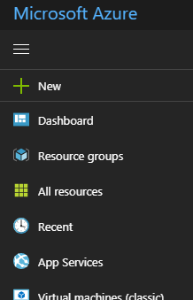

And then from there click on _+ Add_ and choose a _Web App_:

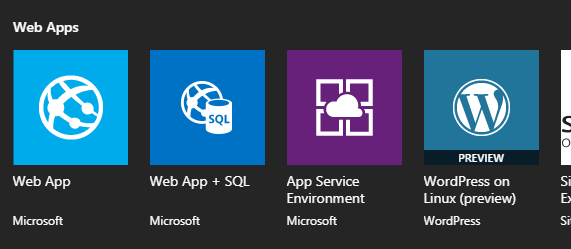

You can then choose your app name and make sure to choose the _Free Plan_:

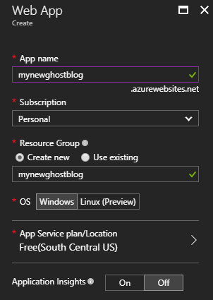

As of this writing, Azure defaults the node version that will run your app to some old-ass version. You'll need to update it to the latest LTS version so that Ghost will run properly. Click on your new app service and then on _Application Settings_. Scroll down and make sure the `WEBSITE_NODE_DEFAULT_VERSION` is set to `8.9.4` (the latest LTS at the time of this writing):

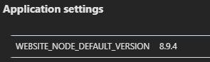

With the correct node version in place, you'll next want to setup deployment for your site. I like using the Github integration so that anytime I push to a particular branch, it will automatically redeploy the site. It will also `npm install` any dependencies during deployment.

Navigate to _Deployment Options_ to choose your source:

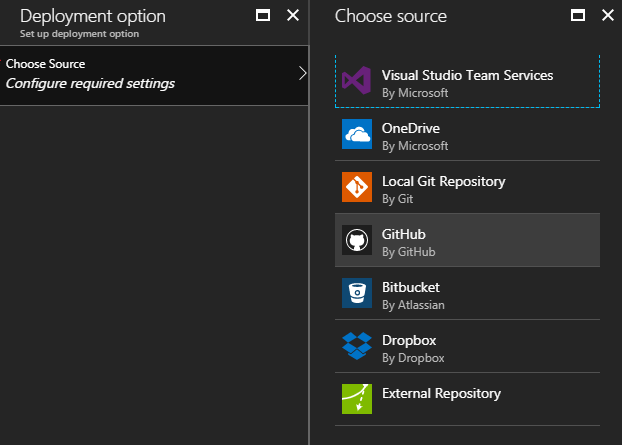

From there, I chose Github and filled in all my settings:

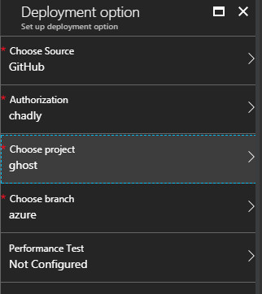

I set my repo up with a few branches for easier maintenance. The `ghost` branch is where I commit the [Ghost releases as they come out](https://github.com/TryGhost/Ghost/releases/latest) unchanged. The `azure` branch is where I made only the changes necessary to get it running on Azure. I rebase this branch off of `ghost` as new releases come out. I then create a separate branch for each site I deploy. e.g. I created a `chadlynet` branch for this site and I create other branches for family members that want their own sites. This way I can make theme customizations and tweaks to individual sites and rebase those changes off of the `azure` branch.

### Settings

Once your site is deployed, you will want to set some environment variables. You can set [any of these options](https://docs.ghost.org/v1.0.0/docs/config), but the main one we want to set is `url`. Click on _Application Settings_ under your app service and then scroll down to _App Settings_. You will want to set `url` (casing matters) to the URL of your site:

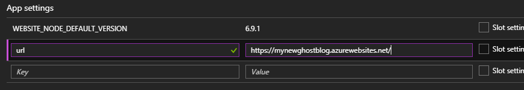

Make sure to _Save_ after setting that setting.

<div class="alert alert-info">
  <i class="fa fa-info-circle" title="Note"></i>

  You don't need to set the `NODE_ENV` as iisnode will set that to `production` for you automatically.
</div>

### A Working Site

You should now have a working site at _yourname.azurewebsites.net_. You can start to set your site up now by logging in at _/ghost_. A limitation of the free tier is that you can't set a custom domain. You are forced to use the _azurewebsites.net_ domain. We shall get around that limitation by using Azure CDN and get some significant performance benefits along with it.

## Azure CDN as a Reverse Proxy

Technically, the [Azure CDN](https://azure.microsoft.com/en-us/services/cdn/) isn't free. But it is so cheap, that it is practically free. For the standard tier, as of this writing, it is $0.087 / GB. For my site, since I am only serving text and small images, it ends up costing me on average a little less than $0.07 / month. Trust me, your shitty blog, like mine, will also not be expensive. 😜

### Static Site Performance

A site like mine (one that doesn't get updated very often) can really benefit from being served like a static site e.g. almost always from cache. If you set the cache headers right in Ghost, you can get this benefit with Azure CDN since it will act as a caching reverse proxy honoring the cache headers from your site.

To setup the caching config for Ghost, you will need to edit the `config.production.json` file in the root:

```json
{
    "caching": {
		"frontend": {
			"maxAge": 72000
		}
	}
}
```

This tells Ghost to cache the frontend of the site (e.g. not the admin section at _/ghost_) at 72,000 seconds = 20 hours. By default, Ghost will set this number to zero. You will want to bump that number to whatever you are most comfortable with. The way I have it setup, when I write or edit a post, it may or may not show up for people depending on where they are for up to 20 hours. I am OK with that for the performance benefits it brings.

There is a little more nuance to this [concerning ETags and things; more on that in another post](/etags-performance/).

### Setup

To setup the CDN, you will want to click on the _+ New_ icon and search for / choose CDN:

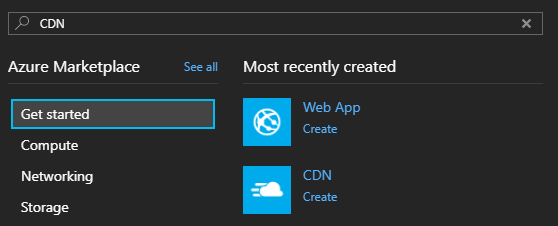

From there, fill in your settings making sure to choose _Standard Verizon_ as the pricing tier. As of this writing, Verizon is the only provider that supports SSL on custom domains. This is supposedly "coming soon" to Akamai, but it is not here yet.

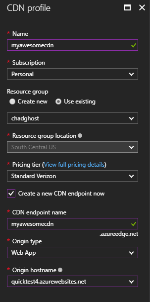

You'll also want to choose _Web App_ as the origin type and choose your existing web app you created previously. You can include the CDN in the same resource group as your web app to make it easier to manage going forward.

After you create your CDN, it takes Verizon 6 hours or so to get off their ass and actually propagate your changes through their network. Until then, your new endpoint _whatever.azureedge.net_ will return `404`s. Don't fret, just relax. Go read a book or something (it is like a movie but on paper).

If you aren't into books, while you wait, you can also setup your custom domain. In your CDN profile, click on _Endpoints_ and then choose the existing endpoint we just setup. From there, click on _+ Custom Domain_. You'll have to setup a `CNAME` to _whatever.azureedge.net_ for your domain.

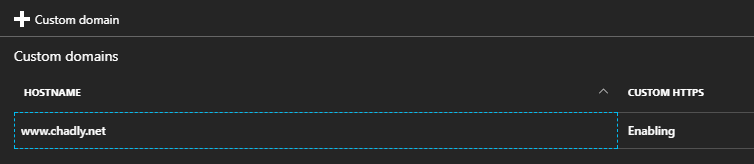

Again, the domain takes way longer to propagate than you think it should. While you are in there, you might as well [take advantage of the free SSL](https://docs.microsoft.com/en-us/azure/cdn/cdn-custom-ssl) that you can get with your domain. Click the custom domain you setup and enable HTTPS:

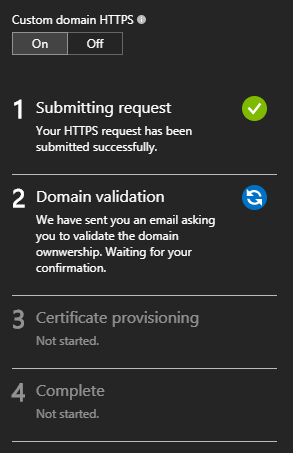

They will send an email to a [bunch of different addresses](https://docs.microsoft.com/en-us/azure/cdn/cdn-custom-ssl#step-2-domain-validation) associated with your domain. Click the link on one of those emails to confirm and setup the SSL.

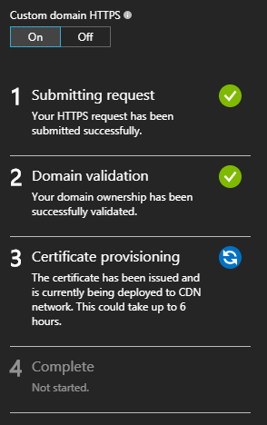

Once that is done, it will take some time to propagate throughout the CDN network.

## Update App Settings

Once you have all of this setup, your site will be exposed on 3 domains, _yoursite.azurewebsites.net_ (the web app), _yoursite.azureedge.net_ (the CDN endpoint), and your custom domain. Your custom domain is obviously the one you count as _your site_, e.g. the canonical version.

If you are worried about search engine penalties for duplicate content, don't be. Ghost will autogenerate a [canonical link element](https://support.google.com/webmasters/answer/139066?hl=en) on each page of your site using the `url` configured in your web app's _App Settings_ (which we setup earlier). You will want to update that URL now to your custom domain with HTTPS. And, yes, [canonical link elements work cross-domain](https://webmasters.googleblog.com/2009/12/handling-legitimate-cross-domain.html).

<div class="alert alert-warning">
<i class="fa fa-exclamation-circle" title="Warning"></i>

You explicitly don't want to setup `301` redirects from your web app to the canonical domain. The CDN reverse proxy would then not be able to access the web app. Just think of the _azurewebsites.net_ version of your site as the non-cached version of your site where you can see your changes before the rest of the world sees them on your "real" site.

</div>

## Final Product

Once I had all of this setup for this site, I decided to perform an experiment. I went to the public facing homepage to prime the CDN cache. I then went into the Azure portal and stopped the underlying app service. So, effectively, this site at the _azurewebistes.net_ domain started returning `503`s and became unavailable. I then refreshed the page on the public facing (CDN) site and everything still worked fine. Then, just to be sure, I opened dev tools and disabled the client cache and refreshed the page again. The server returned a string of beautiful `200`s like nothing was wrong.

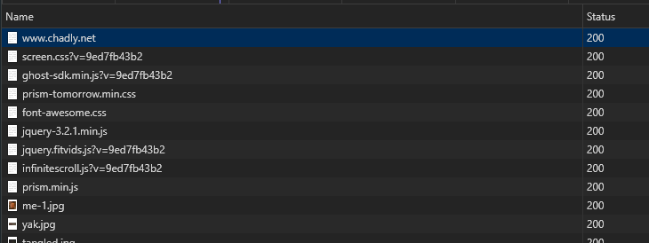

In other words, when everything is running normally, even if this site gets slammed, very little traffic will make it through to the actual Ghost app. The global CDN will relieve all that pressure from the web app and keep the site loading fast for everyone.

I dare somebody to DDOS this site.[^2] 

[^1]: For certain values of free.
[^2]: Not actually. Please leave me alone.