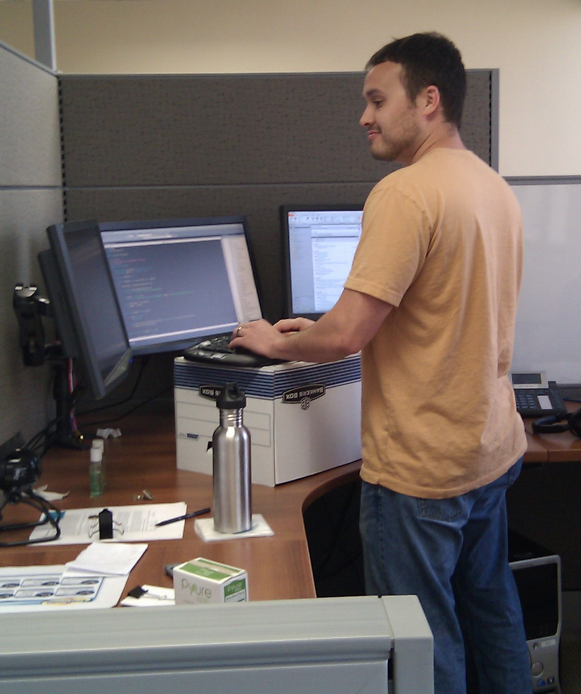
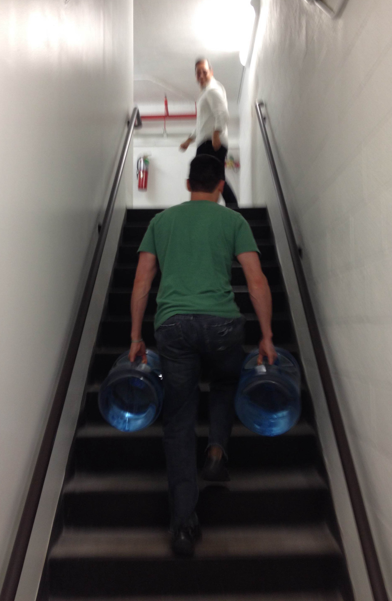

> Start with the foundation.

That's what any sane person will tell you when you go to build a building. It's common sense. You can't build a skyscraper on some weirdly shaped dirt -- you have to first lay a strong foundation.

Your health is the foundation of you. It literally determines what you can and cannot do. If you are strong, healthy, and well rested you will feel like you can do anything. Compare that feeling to someone who is sick and has no desire to even get out of bed.

All else being equal, a strong and healthy person will always outperform a sickly person -- and not just in the physical sense. It seems the zeitgeist is finally catching up to this idea in that employers are taking note that [healthy employees are more productive than sickly employees](http://www.cbsnews.com/news/are-healthier-employees-more-productive/). Whether you are [trying to learn something new](http://www.equitycampaign.org/i/a/document/12557_equitymattersvol6_web03082010.pdf) or just [using your brain to solve complex problems](http://dericbownds.net/uploaded_images/exercise_hillman.pdf) (as software developers tend to do), your health is deeply intertwined with your success.

## The Stereotypical Nerd

> But somehow, as the school nerd who always got picked last for everything, I had allowed _not being good at sports_ or _not being fit_ to enter what I considered to be inherent attributes of myself. The net result is that I was left with an understanding of myself as an incomplete person. And though I had (perhaps) overcompensated for that incompleteness by kicking ass in every other way I could, I was still carrying this powerlessness around with me and it was very slowly and subtly gnawing away at me from the inside.
> <cite>Chad Fowler</cite>

[Chad Fowler](http://chadfowler.com/) talks about his "Harajuku moment" in [_The 4-Hour Body_](http://fourhourbody.com/) -- the moment which led him to take control of his health and lose 70 lbs. I think his story resonates with a lot of people within the software industry. It's hard to reconcile what we do (sitting in front of a computer all day) with being healthy. It is very easy to get stuck in a vicious cycle where you ignore your health for the sake of improving other areas of your life while you slowly drift away from that healthy self-image to the point where you eventually _define_ yourself as someone who "just isn't healthy."

## Staying Healthy Against the Odds

So, how does one stay healthy while sitting on one's ass for so long each day? Short answer: don't sit on your ass for so long each day.

### Standing Desks

Standing desks are all the rage these days because everyone knows that [sitting is killing us](http://www.lifehack.org/articles/lifestyle/why-sitting-is-killing-you.html). There are [plenty of ways](http://kellianderson.com/blog/desk.html) to [make a nice standing desk](http://lifehacker.com/5929765/make-yourself-a-standing-desk-this-weekend) out of your current workspace. It doesn't even have to look nice.

Go find a random box and put your keyboard on top of it. It works for me. Find something that works for you.

### Stand Some of the Time

Standing all day is a lofty goal. A more readily attainable goal is to [just move around more](http://lifehacker.com/5840754/forget-the-standing-desk-you-just-need-to-move-regularly). Once every 20 minutes or so, get up, walk around, and stretch.

> Every 20 minutes!? But...productivity??

Yes, [interrupting a programmer](http://heeris.id.au/2013/this-is-why-you-shouldnt-interrupt-a-programmer) in any way is blasphemy and ruins productivity -- even if it is you interrupting yourself. You may find, however, if you [divide up your work](http://lifehacker.com/5638746/use-a-timer-as-a-productivity-booster-and-sanity-minder) into more manageable time chunks, it will help you to actually become more productive. The idea is to focus intently for short bursts of time with frequent breaks. During one of these breaks is the perfect time to stand up and stretch.

An even simpler method if you don't want to time yourself is to stand up after each commit. If you are [committing early and often](http://www.codinghorror.com/blog/2008/08/check-in-early-check-in-often.html) (like you should), each commit is the completion of an idea or some small chunk of work that you were doing. Stand up and stretch for 30 seconds or walk around or do some jumping jacks. Just do _something_.

## Move Frequently at a Slow Pace

The general theme of the standing desk and the frequent breaks revolves around the idea that you need to move more. Quit being so damn sedentary and go for a walk, hike, or some light bike-riding. Don't get stuck doing "[chronic cardio](http://coachcanadan.wordpress.com/2012/10/21/how-chronic-cardio-can-make-you-gain-weight/)." Not only is it more detrimental to your overall health, but it is harder to do than what I am talking about.

Go outside and take a leisurly walk on your lunch break. Get some sunlight on your bare skin and reconnect with nature -- or concrete if you happen to work in a skyscraper like I do. [Quit eating lunch at your desk](http://randomdrake.com/2014/01/09/never-going-back-a-week-of-not-eating-lunch-at-my-desk/). Instead walk to a nearby park and partake of your food. You might end up discovering something, somewhere, or someone new in the process.

## Lift Heavy Things

Strength training has many benefits to your overall health. In addition to looking and feeling better about yourself, weight training helps [strengthen your bones and can improve your cardiovascular health](http://www.sparkpeople.com/resource/fitness_articles.asp?id=1612).

You don't have to be a "gym rat" or a "meathead" to care about your body and want to get fit for the sake of improving yourself. There are many ways to increase your strength without resorting to paying for a gym membership.

Since I work on the 17th floor of a high-rise, some coworkers and I have begun carrying 5 gallon water jugs (~80 lb) up the stairs twice a week.

Heh, it's less crazy than it looks...

We didn't start out this hardcore. It started with me wanting to move more at work so I decided to start walking up the stairs once a week. Eventually, people found out what I was doing and decided to join me. We then started to do it twice a week, then three times a week. Now we are at the point where we do it every day. We only carry the bottles twice a week, though.

The point is that you need to work with what you got. Look around you and improvise. Start small and build up to something.

### Less is More

When it comes to resistance training, [less really is more](http://www.muscleandstrength.com/articles/buiding-muscle-why-less-is-more.html). If you focus on [compound, full-body movements](https://www.verywell.com/which-is-better-compound-or-isolation-exercises-3120718), you can build overall strength very quickly without living in the gym. It doesn't take much stimulation for your body to start adapting. Err on the side of working out too little rather than overtraining. After all, you are only breaking down your muscles when training -- sleep is when all the magic happens.

## Get More Sleep

All this physical activity means your body needs time to repair itself. Not only is sleep important to your physical health, but -- this may seem obvious -- it is enormously important for your emotional and mental well-being as well. [New studies](http://www.nih.gov/researchmatters/october2013/10282013clear.htm) are coming out all the time showing how important sleep is to all areas of our lives.

If you are [trying to lose weight](http://www.webmd.com/diet/features/lose-weight-while-sleeping) or [make a big decision](http://edition.cnn.com/2012/08/27/business/unconscious-mind-sleep-decision/) or really do _anything_, you need to get enough sleep. Seriously, this is probably the easiest thing to do that will bring [enormous benefits](http://newsinhealth.nih.gov/issue/apr2013/feature1). Get yourself a [good sleep routine](http://www.helpguide.org/life/sleep_tips.htm) and go comatose for 8-10 hours.

## You Are What You Eat

Your body can only use the resources that you give it in order to rebuild itself. You are, _literally_, what you eat. When your mother first conceived you, she ate a bunch of food and eventually turned that into you -- a veritable food baby. Ha, yes, it is probably a little more complicated than that but the basic idea is that the raw materials that were used to build you came from the food your mother ate. Hopefully, you are made of more than just doritos and bagel bites.

It goes deeper than just raw materials, though. What you eat has a profound [effect on your mood](http://www.scientificamerican.com/article/gut-second-brain/) and even [plays a role in your thought process](http://www.npr.org/blogs/health/2013/11/18/244526773/gut-bacteria-might-guide-the-workings-of-our-minds).

### Cut Out the Sugar

Have you ever found yourself too tired to work around 3pm -- moving slowly after lunch -- maybe wishing you lived in a country where siestas are a socially acceptable thing to do? If so, you've just enjoyed a ride on the [blood glucose roller coaster](http://www.onetouch.com/articles/rollercoaster). It doesn't have to be this way. It is possible to not experience that 3pm lull where you just want to curl up in your pajamas.

The formula is pretty simple. Stop eating sugar -- in all of its forms. [Sugar not only makes you fat, it makes you sick](http://thechart.blogs.cnn.com/2014/02/03/sugar-not-only-makes-you-fat-it-may-make-you-sick/). Focus on [low-glycemic foods](http://www.huffingtonpost.com/2012/06/27/low-glycemic-foods-diet_n_1630893.html). In practice, this usually means staying away from bread, pastas, and sweets while eating a lot of vegetables, high quality meat, and healthy fats (avocados, grass-fed butter, etc.).

<i class="fa fa-info-circle" title="Aside"></i>

Yes, I said butter. Sometimes people raise their eyebrow at me when I say that. [Fat doesn't make you fat](http://www.huffingtonpost.com/dr-mark-hyman/fat-health_b_4343798.html). [Saturated fat is not bad for you](http://www.marksdailyapple.com/saturated-fat-healthy). Quit living your life based on research from the '70s. Sugar will kill you while you are busy trying to avoid fat.

If you only do one thing to improve your diet, eliminating sugar is probably the single most effective thing you can do. You may be surprised what a big difference such a seemingly small change can bring about in yourself.

## Don't Start a "Diet"

Don't start a diet that you will get tired of and eventually "cheat" your way back into your unhealthy ways. Don't make "moving more" a [New Year's resolution that you won't stick to](http://www.nbc.com/saturday-night-live/video/resolution-revolution/n45302). Don't try to eat right (only) to lose weight.

Do these things to become a better you. Make an investment in yourself -- a lifestyle change. It will be easier to stick to. Find something that works for you that is not too drastic.  Find something you can live with where you don't feel like you are denying yourself your favorite food or forcing yourself to do a crazy exercise that you don't think is a good idea. Start with a small change and be consistent with it. Make it a habit -- a normal part of your everyday life. You are in this for the long haul. Consistency should be valued over quick, over-arching changes to your lifestyle. A small trajectory change on a sufficiently long line yields big changes in the long run.

> Take the first step, and your mind will mobilize all its forces to your aid. But the first essential is that you begin. Once the battle is started, all that is within and without you will come to your assistance.
> <cite>Robert Collier</cite>

Once you take that first step, everything becomes easier. Just make it a goal to constantly improve yourself. Just do a little more each day. As your body adapts to what you start throwing at it, ratchet up the intensity slightly more. Who knows -- you may find yourself carrying water jugs up the stairs before you know it.